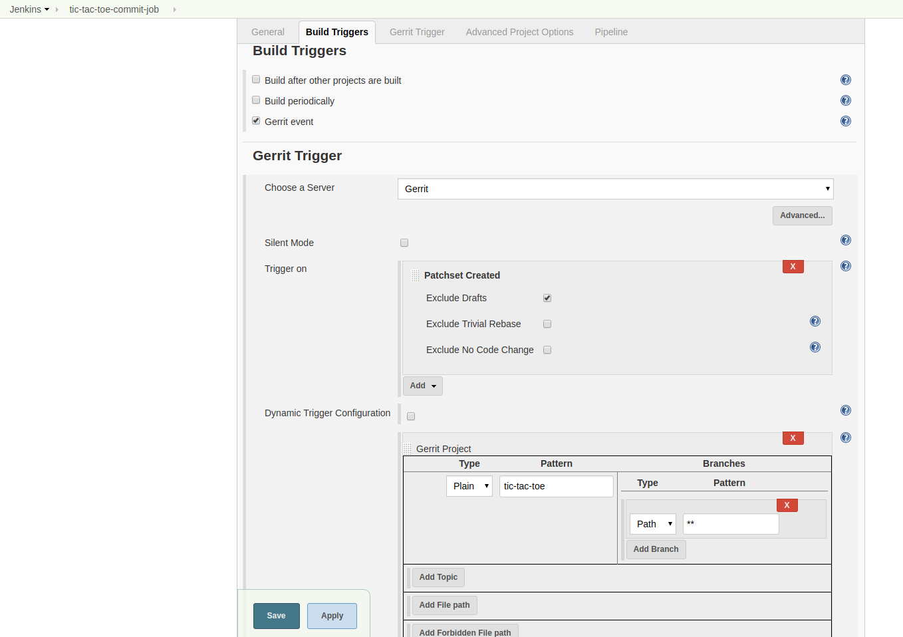
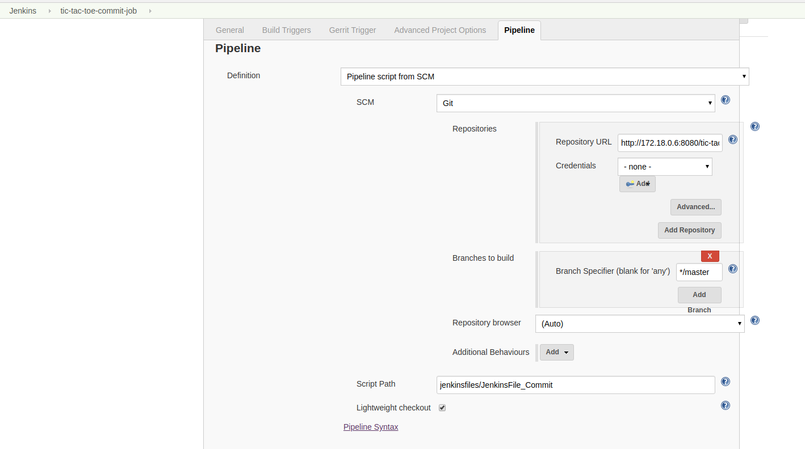
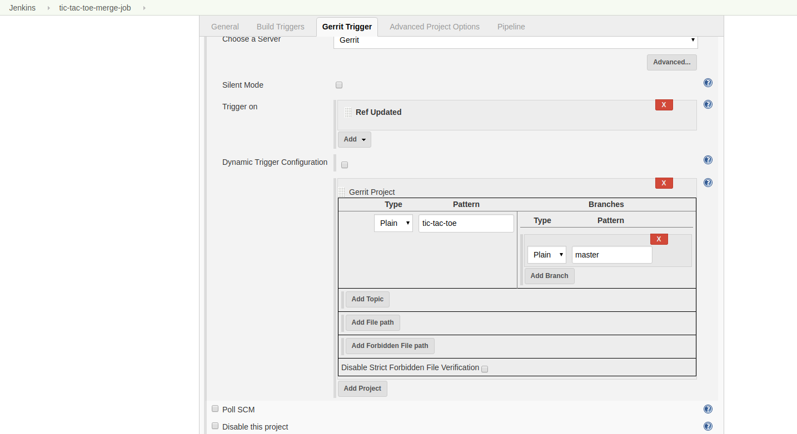
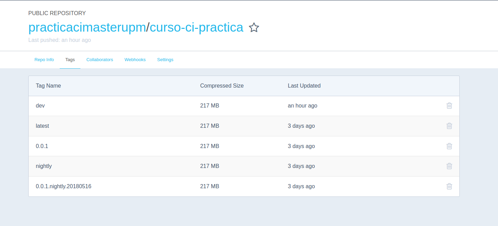
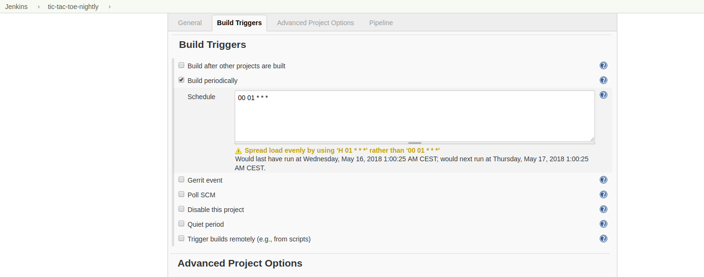
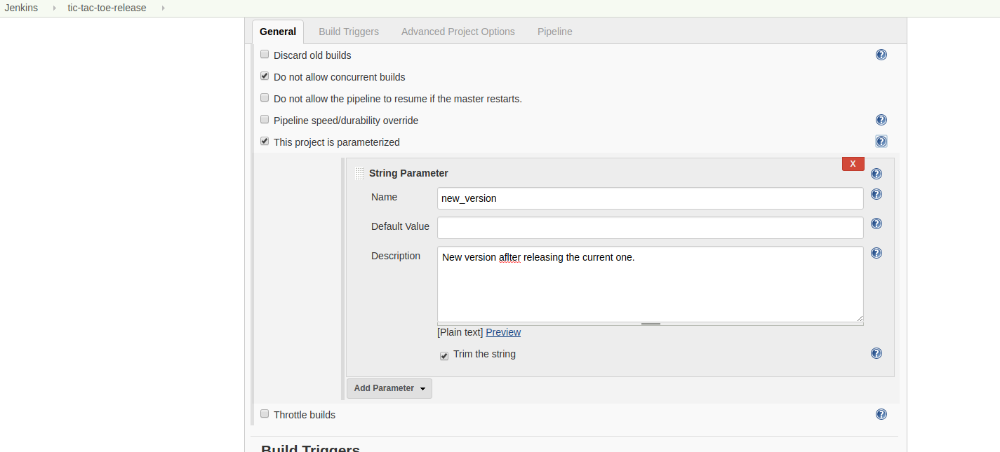

# <p style="text-align: center">Practica final </br>de </br>Integración Continua.</p>
</br></br></br></br>
## Setup inicial
Pasos a realizar para lanzar la forja y tenerla funcionando:

- Configurar las credenciales del usuario developer para ssh: A;adiendo la clave ssh en gerrit.
- Crear un nuevo proyecto en Gerrit con el nombre de tic-tac-toe: Se ha creado una copia en github de este repositorio para que todos los elementos sean accesibles: http://github.com:jlojosnegros/tic-tac-toe-ci
- Subir el codigo del proyecto de pruebas.
    - Ha habido que darle permisos de Verify al usuario admin en refs/heads/* Label: Verify

Nota: Se ha tenido que lanzar una forja anterior porque la ultima que hay en el repo no parece funcionar correctamente el ldap porque el usuario developer no me deja entrar, supongo que por algun problema de comunicacion con el contenedor de ldap.


## Creación de un Job de commit.

Simplemente seguir las instrucciones que estan en las transparencias del tema 7 tal y como hicimos en clase.





Para poder encontrar la URL del repo de Git dentro del contenedor de Gerrit se ha utilizado 'docker inspect' como puede verse en el stage 'Checkout' de los jenkinsfiles.


### JenkinsFile_Commit

```
node {

   stage ('Checkout') {
      GERRIT_IP = sh (
               script: 'docker inspect -f \'{{range .NetworkSettings.Networks}}{{.IPAddress}}{{end}}\' codeurjc-forge-gerrit',
               returnStdout: true
               ).trim()


      git url: 'http://' + GERRIT_IP + ':8080/tic-tac-toe'
   }

   stage ('Unit Testing') {

      docker.image('maven').inside('-v $HOME/.m2:/root/.m2') {

        sh 'mvn -Dtest=BoardTest,TicTacToeGameTest,TicTacToeGamePlayTest test'
        junit testResults: '**/target/surefire-reports/*.xml', keepLongStdio: true
      }
  }

}

```


## Creación de un Job de merge.

Creamos un nuevo job en jenkins utilizando el trigger de gerrit "Ref Updated" tal y como se indica en la documentación.
Ademas hay que cambiar el campo Pattern dentro de Branches porque si ponemos "Path: **" este job tambien se lanza con los commits. Tenemos que poner "Plain: master" en su lugar para que solo sea lanzado cuando se produce un merge con la rama master





### JenkinsFile_Merge


```
node
{
    stage ('Checkout')
    {
        GERRIT_IP = sh (
               script: 'docker inspect -f \'{{range .NetworkSettings.Networks}}{{.IPAddress}}{{end}}\' codeurjc-forge-gerrit',
               returnStdout: true
               ).trim()


        git url: 'http://' + GERRIT_IP + ':8080/tic-tac-toe'
    }
    stage ('Sonarqube')
    {
      docker.image('maven').inside('-v $HOME/.m2:/root/.m2 ' + '--network=ci-network --link codeurjc-forge-sonarqube:sonarqube -v /var/run/docker.sock:/var/run/docker.sock')
      {
        sh 'mvn clean verify sonar:sonar -DsonarqubeURL=sonarqube -DskipTests -Dmaven.test.skip=true'
      }
    }
    stage ('Unit and System Testing')
    {
        try
        {
            docker.image('maven').inside('-p 12345:8080 -v $HOME/.m2:/root/.m2 ' + '-v /var/run/docker.sock:/var/run/docker.sock')
            {
                sh 'mvn -Dtest=BoardTest,TicTacToeGameTest,TicTacToeGamePlayTest,SeleniumSytemTest test'
            }
        }
        catch (Exception err)
        {
            sh 'return -1'
        }
        finally
        {
            archiveArtifacts '**/target/*.flv'
            junit testResults: '**/target/surefire-reports/*.xml', keepLongStdio: true
        }

    }

    stage('Build Target')
    {
        docker.image('maven').inside('-v $HOME/.m2:/root/.m2')
        {
            sh ' mvn package -DskipTests -Dmaven.test.skip=true'
        }
    }

    parallel docker: {
        stage ('Docker image')
        {
            sh 'chmod 777 ./build-merge-image.sh'
            sh './build-merge-image.sh'
            sh 'docker login -u practicacimasterupm -p 12341234'
            sh 'docker push practicacimasterupm/curso-ci-practica:dev'
        }
    }, archiva: {
        try {
            stage ('Archive')
            {
		docker.image('maven').inside('--user root -v $HOME/.m2:/root/.m2 --network=ci-network --link codeurjc-forge-archiva:archiva') {
                    sh ' mvn deploy -DskipTests -Dmaven.test.skip=true -DarchivaURL=http://archiva:8080'
                }

            }
        } catch (Exception err) {
            echo "Cannot publish to archiva"
        }

    }
}

```


### Dockerfile_Merge

```
FROM openjdk:8-jre
ARG GIT_COMMIT=unspecified
LABEL git_commit=$GIT_COMMIT
ARG COMMIT_DATE=unspecified
LABEL commit_date=$COMMIT_DATE
COPY target/*.jar /usr/app/app.jar
WORKDIR /usr/app
CMD [ "java", "-jar", "app.jar" ]
```


### Ficheros auxiliares

build-merge-image.sh

```
#!/bin/bash

docker build --build-arg GIT_COMMIT=$(git rev-parse HEAD) --build-arg COMMIT_DATE=$(git log -1 --format=%cd --date=format:%Y-%m-%dT%H:%M:%S) -f Dockerfile_Merge -t practicacimasterupm/curso-ci-practica:dev .
```


### Otros

#### Docker

En este jobs, y en otros posteriores, se crean imagenes docker y se suben al repositorio de dockerhub. Para todas estas operaciones se ha utilizado una cuenta especialmente creada para este proposito: practicacimasterupm/curso-ci-practica

Aqui podemos ver una captura de algunas de las imagenes subidas durante las pruebas:



#### SonarQube

Para realizar las labores de inspeccion de codigo se han creado una serie de imagenes docker para poder levantar un servidor dockerizado de sonarqube.

- Lo primero ha sido crear un contenedor basado en Ubuntu para tener el volumen donde poder persistir los datos de la base de datos postgresql

```
sudo docker run -itd  --name codeurjc-forge-vc-sonarqube-postgres -v /var/lib/postgresql/data ubuntu
```

- Seguidamente se lanza la base de datos haciendo que utilice el volumen creado.

```
sudo docker run --name codeurjc-forge-sonarqube-postgres --network=ci-network --volumes-from codeurjc-forge-vc-sonarqube-postgres -p 5555:5432 -e POSTGRESS_PASSWORD=mysecretpassword -d postgres
```

- Por ultimo solo queda lanzar el servidor de sonarqube y conectarlo con la base de datos.

```
sudo docker run -d --name codeurjc-forge-sonarqube --network=ci-network --link codeurjc-forge-sonarqube-postgres:sonarqube-postgres  -p 9000:9000 -p 9092:9092 -e SONARQUBE_JDBC_USERNAME=postgres -e SONARQUBE_JDBC_PASSWORD=mysecretpassword -e SONARQUBE_JDBC_URL=jdbc:postgresql://sonarqube-postgres/sonar sonarqube
```

Nota: En la primera ocasion en la que se lanze la base de datos tenemos que crear una base de datos llamada sonar como parte de la configuracion ...
Para ello tendremos que ejecutar lo siguiente una vez lanzado el contenedor de la base de datos:

```
>sudo docker exec -it -u postgres codeurjc-forge-sonarqube-postgres psql
```
Una vez dentro del contenedor y del psql, ejecutar:
```
psql> create database sonar;
```

Como configuracion adicional para sonarqube tendremos que dar de alta el servicio en el settings.xml.


## Creación de un Job de nightly.


### JenkinsFile_Nightly.

Para la creacion de este job se utlizó el trigger "Build Periodically" que utiliza una sintaxis similar a la de la herramientra "cron" para poder definir cuando se ejecuta un job.
En la imagen podemos ver la configuracion elegida para cumplir con los requisitos:




En la creacion de este job hubo que trabajar con varios scripts de shell y con algunos comandos de maven para la lectura de las versiones del projecto y su posterior manipulacion. Esto plantea un problema, ya que para la lectura de la version del proyecto necesitamos un contenedor que tenga maven, mientras que para poder crear y subir una imagen docker al repositorio, se necesita un contenedor que tenga docker. Este hecho obliga a pasar informacion entre pasos, pero parece que esto es algo que, segun lo que he podido investigar en la red, no contempla de manera sencilla y por ahora Jenkins, de manera que la unica manera que he encontrado ha sido mediante la escritura de ficheros temporales.

```
node
{
    stage ('Checkout')
    {
        GERRIT_IP = sh (
               script: 'docker inspect -f \'{{range .NetworkSettings.Networks}}{{.IPAddress}}{{end}}\' codeurjc-forge-gerrit',
               returnStdout: true
               ).trim()


        git url: 'http://' + GERRIT_IP + ':8080/tic-tac-toe'
    }

    stage ('Unit and System Test')
    {
        try
        {
            docker.image('maven').inside('-p 12345:8080 -v $HOME/.m2:/root/.m2 ' + '-v /var/run/docker.sock:/var/run/docker.sock')
            {
                sh 'mvn -Dtest=BoardTest,TicTacToeGameTest,TicTacToeGamePlayTest,SeleniumSytemTest test'
            }
        }
        catch (Exception err)
        {
            sh 'return -1'
        }
        finally
        {
            archiveArtifacts '**/target/*.flv'
            junit testResults: '**/target/surefire-reports/*.xml', keepLongStdio: true
        }

    }

    stage('Build Target')
    {
        docker.image('maven').inside('-v /var/run/docker.sock:/var/run/docker.sock')
        {
            sh ' mvn package -DskipTests -Dmaven.test.skip=true'
        }
    }

    stage ('Docker image')
    {
        docker.image('maven').inside('-v /tmp:/tmp')
        {
            version = sh (
                script:'mvn -q -Dexec.executable="echo" -Dexec.args=\'${project.version}\' --non-recursive org.codehaus.mojo:exec-maven-plugin:1.3.1:exec',
                returnStdout: true
                ).trim()
            println version
            sh 'chmod 777 ./calculate-docker-nightly-tag.sh'
            tag = sh (
                script: './calculate-docker-nightly-tag.sh ' + version,
                returnStdout: true
                ).trim()
            println tag
            println "... tag file ..."
            writeFile file: "/tmp/tag", text: tag
        }
        println "reading tag file outside docker.inside"
        def tag = readFile('/tmp/tag').trim()

        sh 'chmod 777 ./build-and-push-nightly-image.sh'
        sh './build-and-push-nightly-image.sh ' + tag
    }

    stage ('execute test with docker image')
    {
        return 0
    }

    stage ('Docker image final')
    {
        sh 'chmod 777 ./build-and-push-nightly-image.sh'
        sh './build-and-push-nightly-image.sh ' + 'nightly'
    }
}

```


### Dockerfile_Nightly

```
FROM openjdk:8-jre
ARG GIT_COMMIT=unspecified
LABEL git_commit=$GIT_COMMIT
ARG COMMIT_DATE=unspecified
LABEL commit_date=$COMMIT_DATE
COPY target/*.jar /usr/app/app.jar
WORKDIR /usr/app
CMD [ "java", "-jar", "app.jar" ]
```

### Ficheros auxiliares

#### build-and-push-nightly-image.sh
```
#!/usr/bin/env bash

tag=$1
docker build --build-arg GIT_COMMIT=$(git rev-parse HEAD) --build-arg COMMIT_DATE=$(git log -1 --format=%cd --date=format:%Y-%m-%dT%H:%M:%S) -f Dockerfile_Nightly -t practicacimasterupm/curso-ci-practica:${tag} .

 docker push practicacimasterupm/curso-ci-practica:${tag}
```

#### calculate-docker-nightly-tag.sh
```
#!/usr/bin/env bash


current_pom_version=$1
date=`date +%Y%m%d`
string='nightly'

match_expression='^([0-9]*)\.([0-9]*)\.([0-9]*)-(.*)$'

tag=""
if [[ ${current_pom_version} =~ $match_expression ]]; then
    tag=${BASH_REMATCH[1]}\.${BASH_REMATCH[2]}\.${BASH_REMATCH[3]}\.${string}\.${date}
fi

echo $tag
```


## Creación de un Job de Release.

Para la creacion de este job, y como se necesitaba que admitiese como parametro una nueva version se utilizo la siguiente configuracion:





### JenkinsFile_Release

Tanto el dockerfile como el script que crea y sube la imagen son compartidos con el job de nigtly.

```
node
{
    stage ('Checkout')
    {
        GERRIT_IP = sh (
               script: 'docker inspect -f \'{{range .NetworkSettings.Networks}}{{.IPAddress}}{{end}}\' codeurjc-forge-gerrit',
               returnStdout: true
               ).trim()
        git url: 'http://' + GERRIT_IP + ':8080/tic-tac-toe'
    }
    stage('Change poml')
    {
        docker.image('maven').inside('-v $HOME/.m2:/root/.m2')
        {
            version = sh (
                script:'mvn -q -Dexec.executable="echo" -Dexec.args=\'${project.version}\' --non-recursive org.codehaus.mojo:exec-maven-plugin:1.3.1:exec',
                returnStdout: true
                ).trim()
            println version
            sh 'chmod 777 ./delete-snapshot-version.sh'
            release_version = sh (
                script: './delete-snapshot-version.sh ' + version,
                returnStdout: true
                ).trim()
            println release_version

            sh 'mvn versions:set -DnewVersion=' + release_version
        }
    }

    stage ('Unit and System Test')
    {
        try
        {
            docker.image('maven').inside('-p 12345:8080 -v $HOME/.m2:/root/.m2 ' + '-v /var/run/docker.sock:/var/run/docker.sock')
            {
                sh 'mvn -Dtest=BoardTest,TicTacToeGameTest,TicTacToeGamePlayTest,SeleniumSytemTest test'
            }
        }
        catch (Exception err)
        {
            sh 'return -1'
        }
        finally
        {
            archiveArtifacts '**/target/*.flv'
            junit testResults: '**/target/surefire-reports/*.xml', keepLongStdio: true
        }

    }

    stage('Build Target')
    {
        docker.image('maven').inside('-v $HOME/.m2:/root/.m2')
        {
            sh ' mvn package -DskipTests -Dmaven.test.skip=true'
        }
    }

    stage('Publish artifact in Archiva')
    {
	docker.image('maven').inside('--user root -v $HOME/.m2:/root/.m2 --network=ci-network --link codeurjc-forge-archiva:archiva')
	{
            sh ' mvn deploy -DskipTests -Dmaven.test.skip=true -DarchivaURL=http://archiva:8080'
        }
    }

    stage ('Docker image')
    {
        docker.image('maven').inside('-v /tmp:/tmp -v $HOME/.m2:/root/.m2')
        {
            version = sh (
                script:'mvn -q -Dexec.executable="echo" -Dexec.args=\'${project.version}\' --non-recursive org.codehaus.mojo:exec-maven-plugin:1.3.1:exec',
                returnStdout: true
                ).trim()
            println version

            println "... tag file ..."
            writeFile file: "/tmp/tag", text: version
        }
        println "reading tag file outside docker.inside"
        def tag = readFile('/tmp/tag').trim()

        sh 'chmod 777 ./build-and-push-nightly-image.sh'
        sh './build-and-push-nightly-image.sh ' + tag
        sh './build-and-push-nightly-image.sh latest'
    }

    stage('Git tag')
    {
        return 0
    }

    stage('Update pom.xml')
    {
        docker.image('maven').inside('-v $HOME/.m2:/root/.m2')
        {
            println "new version"
            println new_version
            sh 'chmod 777 ./add-snapshot-version.sh'
            final_version = sh (
                script: './add-snapshot-version.sh ' + new_version,
                returnStdout: true
                ).trim()

            println "final_version "
            println final_version
            sh 'mvn versions:set -DnewVersion=' + final_version
        }
    }

}

```

### Ficheros auxiliares

#### delete-snapshot-version.sh

```
#!/usr/bin/env bash


current_pom_version=$1
match_expression='^([0-9]*)\.([0-9]*)\.([0-9]*)-SNAPSHOT$'

release_version=""
if [[ ${current_pom_version} =~ $match_expression ]]; then
    release_version=${BASH_REMATCH[1]}\.${BASH_REMATCH[2]}\.${BASH_REMATCH[3]}
fi

echo $release_version
```

#### add-snapshot-version.sh

```
#!/usr/bin/env bash


current_pom_version=$1
match_expression='^([0-9]*)\.([0-9]*)\.([0-9]*)-SNAPSHOT$'

new_version=""
if [[ ${current_pom_version} =~ $match_expression ]]; then
    new_version=${current_pom_version}
else
    new_version=${current_pom_version}'-SNAPSHOT'
fi

echo $new_version
```
